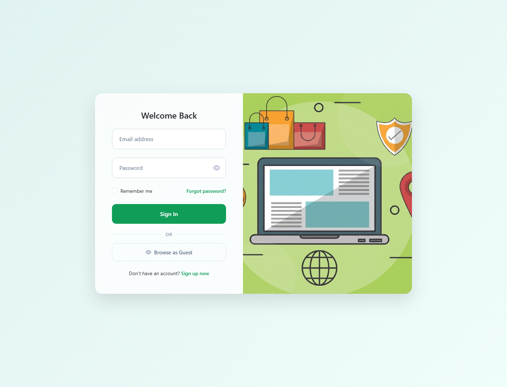
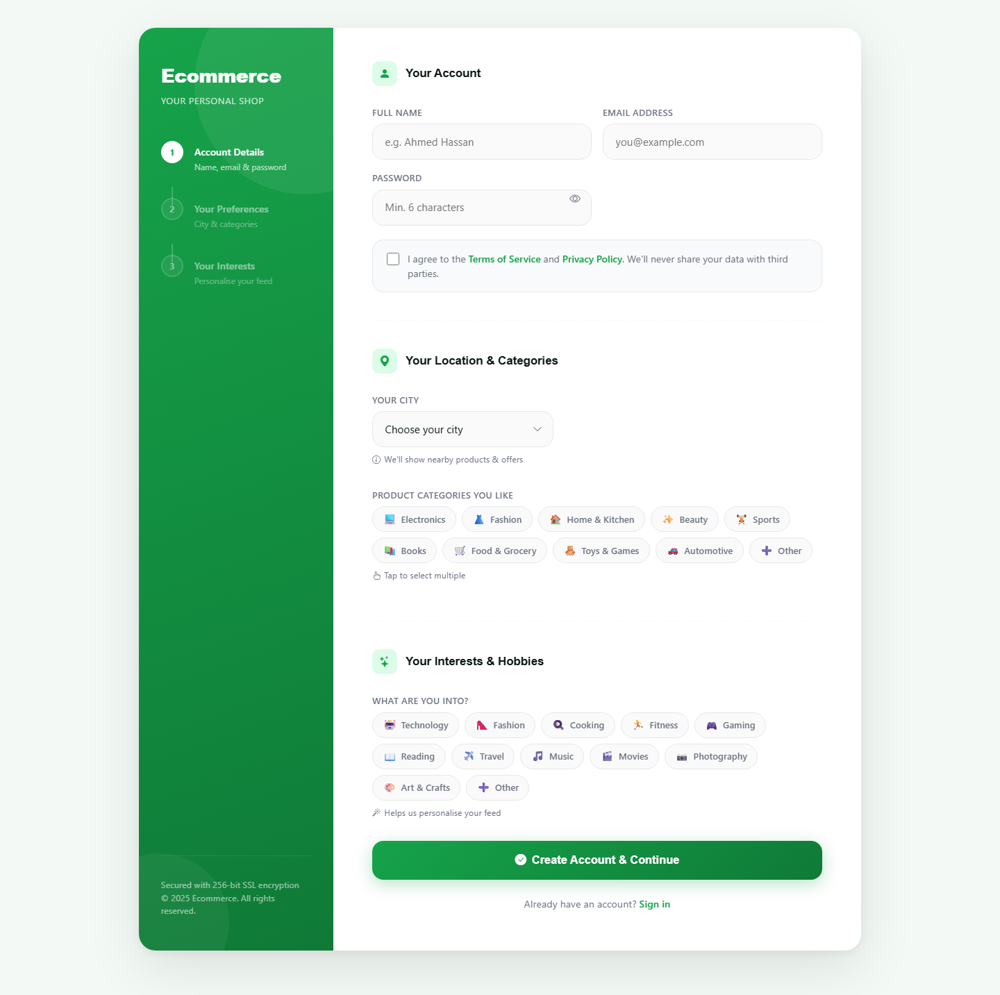
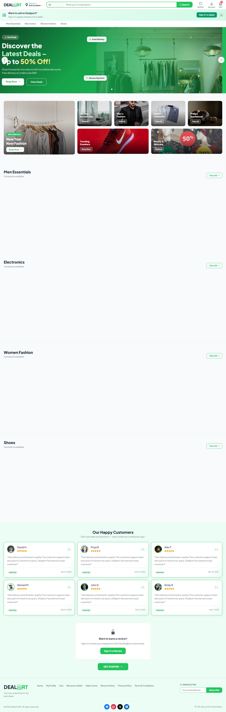

# DEALPORT - Multi-Role E-Commerce Marketplace

DEALPORT is a professional frontend-only e-commerce marketplace built as an academic CST project.  
It delivers three dedicated experiences in one platform:

- Customer storefront for browsing, shopping, checkout, wishlist, and profile management
- Seller dashboard for product, order, category, and review management
- Admin panel for platform oversight, moderation, analytics, and user control

The project is implemented with vanilla JavaScript, HTML, CSS, Bootstrap, and jQuery, with data persistence handled through MockAPI, browser `localStorage`, and Cloudinary for image uploads.

**Live Demo:** [https://cst-ptoject.vercel.app/Html/Customer/Login.html](https://cst-ptoject.vercel.app/Html/Customer/Login.html)

## Key Highlights

- Role-based access for Customer, Seller, and Admin users
- Product browsing with categories, filtering, sorting, and search
- Product details with gallery, related products, stock checks, and reviews
- Cart, wishlist, and checkout flow with order tracking
- Seller tools for product CRUD, order management, category suggestions, and review viewing
- Admin tools for user management, seller approvals, product moderation, category approvals, and analytics
- Profile management with editable user details and image upload support
- Responsive interface built for modern browsers

## Screenshots

| Login | Register | Customer Home |
| --- | --- | --- |
|  |  |  |

## Features

### Customer Experience

- Register, log in, and manage a personal profile
- Browse products by category and view product details
- Add products to cart and wishlist
- Update quantities, apply promo codes, and complete checkout
- Track order status and view order history
- Submit product reviews and helpful votes
- Apply to become a seller from inside the platform

### Seller Experience

- Access a dedicated seller dashboard
- Add, edit, and remove products
- Manage product media and stock status
- Review and update order information
- View customer activity and product feedback
- Suggest new categories for admin approval

### Admin Experience

- View platform-wide statistics and analytics
- Manage customers, sellers, products, orders, and categories
- Approve or reject seller requests
- Moderate content and control user access
- Review platform activity and maintain system oversight

## Tech Stack

- HTML5
- CSS3
- Bootstrap 5.3
- JavaScript (ES Modules)
- jQuery 3.7
- MockAPI
- Cloudinary
- Chart.js
- Leaflet.js

## Project Structure

```text
CST Project/
|-- Html/
|   |-- Customer/
|   |-- Seller/
|   `-- Admin/
|-- JS/
|   |-- Core/
|   |-- Customer/
|   |-- Seller/
|   `-- Admin/
|-- CSS/
|   |-- Customer/
|   |-- Seller/
|   `-- Admin/
|-- Images/
|-- Libraries/
`-- README.md
```

## Getting Started

This project is a static frontend application, so no build step is required.

### Prerequisites

- A modern browser such as Chrome, Edge, Firefox, or Safari
- A local static server, such as VS Code Live Server

### Run Locally

```bash
git clone https://github.com/Mohammedmahmoud2003/CST-ptoject.git
cd CST-ptoject
```

Then open the project with a local server and launch one of the HTML entry points, for example:

- `Html/Customer/Login.html`
- `Html/Customer/CustomerHomePage.html`
- `Html/Admin/admin-panel.html`

> The project should be served over HTTP, not opened directly as `file://`, because it uses ES Modules.

## Configuration Notes

Some features depend on external services:

- **MockAPI** for user and product data
- **Cloudinary** for image uploads

If you are maintaining the project, review the configuration inside:

- `JS/Core/Storage.js`
- `JS/Core/FileStorage.js`

## Team Project

This repository was created for the CST track at the Information Technology Institute (ITI).

## License

This project is intended for educational use.
